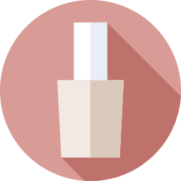

# Unhas Da Cris - Loja de Produtos para Unhas

Um e-commerce completo para produtos de manicure e cuidados com as unhas, desenvolvido como projeto acadêmico.

## 📌 Funcionalidades Principais

- **Catálogo de Produtos**: 15+ itens para cuidados com as unhas
- **Filtro por Categorias**: 6 categorias diferentes (Kits, Esmaltes, Tratamentos, etc.)
- **Carrinho de Compras**:
  - Adicionar/remover produtos
  - Cálculo automático do total
  - Persistência com cookies
- **Temas Personalizáveis**: 3 temas disponíveis
- **Carrossel de Banners**: Com navegação e indicadores
- **Design Responsivo**: Mobile-first e adaptável

## 🛠️ Tecnologias Utilizadas

- HTML5 semântico
- CSS3 com Variáveis
- JavaScript Moderno (ES6+)
- jQuery (apenas para o carrossel)
- JSON para configurações

## 🚀 Como Usar

1. Baixe todos os arquivos
2. Abra `index.html` no navegador
3. Navegue pelos produtos
4. Teste as funcionalidades:
   - Adicione itens ao carrinho
   - Mude os temas
   - Filtre por categorias

## ✨ Destaques Técnicos

- **Organização CSS**: Uso de variáveis para temas
- **JavaScript Modular**: Classes separadas para cada funcionalidade
- **Persistência**: Cookies para carrinho e tema selecionado
- **Performance**: Lazy loading em imagens
- **Acessibilidade**: Atributos ARIA e foco keyboard

## 📜 Licença

Livre para uso educacional. Proibida comercialização sem autorização.